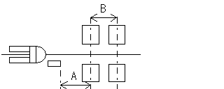

# ABMD 不具合まとめ

作成者：技術部 佐倉  
作成日：2026年9月25日

## 概要

ABMDの自動荷下ろし動作について、以下の不具合を確認した。

| No. | 不具合 | 状況 |
|---|---|---|
| 1 | 移載後に磁気テープへ復帰できず、通路外へ脱線する | 対策プログラムを修正し、期待通りの動作を確認済み |
| 2 | 荷物があるのに空き地と判断し、荷下ろし動作に入る | 設定値を修正し、期待通りの動作を確認済み |
| 3 | 荷下ろし後にパレットを引きずることがある | 構造面の追加検討が必要 |

---

## 不具合1：移載後に磁気テープへ復帰できず、通路外へ脱線する

### 概要

通路脇へ荷下ろしした後、磁気テープ上へ戻る動作で磁気テープを通り越し、通路外へ脱線することがある。

### 期待する動作

自動荷下ろし後、磁気テープ上へ復帰したら、そのまま磁気テープに沿って走行する。

### 実際の動作

荷下ろし後、オンラインランプは点灯するため磁気テープを検出しているが、磁気テープを通り過ぎて通路外へ出てしまう。

### 原因

磁気テープへ復帰した際、磁気ガイドセンサがフルビットに近い状態となり、車体がほぼテープ中央にいると認識していた。

その状態でオフラインになると直前の状態を保持するため、テープ中央にいると認識したまま直進し、磁気テープから外れていた。

### 対策・確認結果

展示会後に動作を詳細に確認した結果、展示会中に実施した対策プログラム（シーケンスラダー）が正常に機能していないことが判明した。

プログラムを修正し、正しく機能することを確認した。その結果、磁気テープへ復帰した後、そのままテープに沿って走行する期待通りの動作となった。

---

## 不具合2：荷物があるのに空き地と判断し、荷下ろし動作に入る

### 概要

荷物が置かれているにもかかわらず空き地と判断し、磁気テープから外れて荷下ろし動作に入ることがある。

### 期待する動作

荷物がある場合は空き地と判断せず、荷下ろし動作に入らない。

### 実際の動作

荷物があるにもかかわらず、荷物と荷物の間の隙間などを空き地として認識し、荷下ろし動作に入ってしまう。

### 原因

空き地判定に使用する以下の設定値が適切ではなかった。

- 荷物の有無を検出する検出幅
- 検出幅内で何回スキャンしたら空き地と判断するかを決めるスキャン回数

本来は、荷下ろししたい位置をピンポイントで確認できるように検出幅を狭く設定し、検出幅に対してぎりぎりスキャンできる回数を設定する必要がある。

しかし今回は検出幅を広く設定し、さらにスキャン回数も少なく設定していた。そのため、荷物がある場合でも荷物間の隙間を検出し、その隙間を空き地と判断していた。

### 対策・確認結果

- 検出幅を適切な範囲まで狭くする。
- 検出幅に対して十分なスキャン回数を設定する。

検出幅とスキャン回数を適正値に修正することで、期待通りの動作となった。

---

## 不具合3：荷下ろし後にパレットを引きずる

### 概要

空パレットやパレット上の荷物が軽く、床面にうねりがあってパレットと床面の間に隙間ができる場合、荷下ろし後にフォークがパレットから抜けず、パレットを引きずることがある。

### 期待する動作

パレットの重量や床面の状態にかかわらず、荷下ろし後にパレットを引きずらず、安心して使用できる商品にする。

### 対策案

- フォーク根元の数十 mm を利用して補助輪を設置する。
- 下限LSよりさらに下までフォークを下げられる機構を検討する。
- フォークホイールを確実に引き込める構造を検討する。
- ボギー車輪ではなく、シングル車輪の採用を検討する。

### 実機確認結果・今後の検討

実機で検証した結果、フォーク延長の影響もあり、補助輪をフォーク中央付近に配置しないとフォーク先端を十分に下げられないことが分かった。

しかし、中央付近に補助輪を配置するとパレットを積載できなくなるため、補助輪はフォーク根元付近に配置する必要がある。

そのため、補助輪の位置を変更するだけでなく、油圧シリンダを下限まで確実に下げる別の機構が必要と考える。

フォークホイールを手で補助すると軽い力で押し込めることから、油圧シリンダをばねなどで縮む方向へ引く「ハンドプレス」のような機構も検討する。

### 今後の目標

パレットの重量や床面の状態にかかわらず、荷下ろし後にパレットを引きずる心配がない構造を実現する。